# Zero-Vector MCP v3.0: Hybrid Vector-Graph AI Memory System with LangGraph Workflows

**🚀 STATUS: PRODUCTION READY** | **Infrastructure: VALIDATED** | **LangGraph: OPERATIONAL**

A complete AI persona memory management system combining a high-performance hybrid vector-graph database server with advanced LangGraph workflow orchestration and a Model Context Protocol (MCP) interface for sophisticated AI memory, relationship understanding, and multi-agent coordination.

🔗 **GitHub Repository:** [https://github.com/MushroomFleet/zero-vector-MCP](https://github.com/MushroomFleet/zero-vector-MCP)

## 🎯 System Status: OPERATIONAL

**Last Infrastructure Validation**: June 21, 2025  
**Current Version**: v3.0 Production-Ready  
**Zero-Vector v2 Server**: ✅ Active (Port 3000)  
**Zero-Vector v3 LangGraph**: ✅ Active (Port 3001)  
**MCP Server**: ✅ Active (Multi-server coordination)  

### ✅ Recently Validated Infrastructure
- **LangGraph StateGraph Schema**: Resolved with proper Zod integration  
- **Multi-Agent Orchestration**: 7-node workflow graph operational  
- **Human-in-the-Loop Processing**: Approval workflows functional  
- **Performance Caching**: Redis/PostgreSQL integration active  
- **Service Coordination**: v2/v3 system coordination validated  
- **MCP Integration**: 24 tools fully operational across both systems  

### 📊 Confirmed Performance Metrics
- **Startup Time**: 2-3 seconds for complete system initialization  
- **LangGraph Compilation**: <3ms for 7-node workflow graphs  
- **Vector Operations**: <50ms for 10,000+ vector searches  
- **Workflow Execution**: <2s for standard AI conversations  
- **Memory Integration**: <500ms for hybrid memory retrieval  
- **Cache Hit Rate**: 95%+ performance optimization  

## 🎯 Overview

Zero-Vector MCP v3.0 provides a production-ready hybrid vector-graph solution with advanced LangGraph workflow capabilities for AI persona management, featuring:

- **Hybrid Vector-Graph Engine** - Combines semantic search with knowledge graph traversal
- **LangGraph Workflow Orchestration** - Multi-agent coordination with human-in-the-loop processing
- **AI Persona Memory with Relationships** - Context-aware memory with entity extraction and graph building
- **Enhanced MCP Integration** - 24 specialized tools including workflow management, graph exploration, and advanced content access
- **Multi-Step Reasoning** - Sophisticated reasoning chains with approval gates and performance monitoring
- **Knowledge Graph Intelligence** - Automatic entity recognition and relationship mapping
- **Production-Ready Architecture** - Feature flags, comprehensive monitoring, and zero-downtime deployment

## 🏗️ System Architecture

```mermaid
graph TB
    subgraph "AI Development Environment"
        A[Cline AI Assistant] --> B[MCP Client]
    end
    
    subgraph "Zero-Vector MCP v3.0 System"
        B --> C[MCP Server v3.0]
        C --> D[Zero-Vector v2 API]
        C --> E[Zero-Vector v3 API]
        
        subgraph "Zero-Vector v2 (Original System)"
            D --> F[Hybrid Vector Store]
            D --> G[Graph Database]
            D --> H[SQLite Metadata]
        end
        
        subgraph "Zero-Vector v3 (LangGraph System)"
            E --> I[LangGraph Workflow Engine]
            I --> J[Multi-Agent Orchestration]
            I --> K[Human Approval Service]
            I --> L[Performance Cache Manager]
            I --> M[State Management]
        end
        
        subgraph "v3.0 Core Services"
            N[Hybrid Memory Manager]
            O[Entity Extractor]
            P[Graph Service]
            Q[Embedding Service]
            R[Feature Flags]
            S[Workflow Manager]
            T[Approval Service]
        end
        
        D --> N
        D --> O
        D --> P
        D --> Q
        D --> R
        E --> S
        E --> T
        
        subgraph "LangGraph Agents"
            U[Hybrid Retrieval Agent]
            V[Persona Memory Agent]
            W[Multi-Step Reasoning Agent]
            X[Human Approval Agent]
        end
        
        J --> U
        J --> V
        J --> W
        J --> X
        
        subgraph "Knowledge Graph"
            Y[Entities]
            Z[Relationships]
            AA[Graph Traversal]
        end
        
        G --> Y
        G --> Z
        G --> AA
    end
    
    subgraph "External Services"
        BB[OpenAI Embeddings]
        CC[Local Transformers]
        DD[PostgreSQL Checkpointer]
        EE[Redis Cache]
    end
    
    Q --> BB
    Q --> CC
    M --> DD
    L --> EE
    
    style A fill:#e1f5fe
    style C fill:#f3e5f5
    style F fill:#e8f5e8
    style G fill:#ffeb3b
    style I fill:#e3f2fd
    style J fill:#e8f5e8
    style N fill:#fff3e0
    style O fill:#e1f5fe
    style P fill:#e1f5fe
    style Q fill:#fff3e0
    style R fill:#f3e5f5
    style S fill:#e3f2fd
    style T fill:#ffcdd2
```



## 🚀 Quick Start

### Prerequisites

- Node.js 18.0.0 or higher
- 4GB+ available RAM (recommended for v3.0)
- PostgreSQL (for LangGraph checkpointing)
- Redis (for performance caching)
- Git

### Installation

```bash
# Clone the repository
git clone https://github.com/MushroomFleet/zero-vector-3.git
cd zero-vector-3

# 1. Set up the Zero-Vector v2 server (Original System)
cd zero-vector/server
npm install
npm run setup:database
npm run generate:api-key  # Generate API key for MCP
cp env.example .env  # Add your OpenAI API key
npm start  # Runs on port 3000

# 2. Set up the Zero-Vector v3 server (LangGraph System)
cd zero-vector-3/server
npm install
cp env.example .env  # Configure environment
npm run setup:postgres # install postgre16.9 & redis first
npm run setup:infrastructure  # Setup PostgreSQL and Redis
npm start  # Runs on port 3001

# 3. Set up the MCP server (in a new terminal)
cd MCP
npm install
cp env.example .env
# Edit .env with both server URLs and API keys
npm start
```

### Quick Test

```bash
# Test the vector database (v2)
curl http://localhost:3000/health

# Test the LangGraph system (v3)
curl http://localhost:3001/health

# Test MCP server connection (both systems)
cd MCP
npm run test:connection
```

## 📚 Component Documentation

This system consists of three main components, each with detailed documentation:

### 🗄️ Zero-Vector v2 Server (Original System)
**Location:** [`zero-vector/README.md`](zero-vector/README.md)

The core vector database server providing:
- High-performance vector storage and similarity search
- RESTful API for vector operations
- SQLite metadata persistence
- Authentication and security middleware
- Real-time monitoring and health checks

### 🤖 Zero-Vector v3 Server (LangGraph System)
**Location:** [`zero-vector-3/README.md`](zero-vector-3/README.md)

The advanced LangGraph workflow server providing:
- Multi-agent workflow orchestration
- Human-in-the-loop approval processing
- Advanced reasoning chains and state management
- Performance caching and monitoring
- PostgreSQL checkpointing and Redis caching

### 🔌 MCP Server v3.0
**Location:** [`MCP/README.md`](MCP/README.md)

The Model Context Protocol interface providing:
- 24 specialized tools for persona, memory, graph, and workflow management
- Multi-server coordination between v2 and v3 systems
- LangGraph workflow management capabilities
- Seamless integration with AI development tools
- Comprehensive error handling and validation

## ✨ Key Features

### LangGraph Workflow Management (NEW in v3.0)
- **Multi-Agent Orchestration**: Sophisticated agent coordination with state management
- **Human-in-the-Loop Processing**: Approval workflows with resume capabilities
- **Multi-Step Reasoning**: Complex reasoning chains with configurable depth
- **Performance Monitoring**: Real-time metrics and analytics for workflow optimization
- **Thread Continuity**: Persistent conversation state across sessions
- **Workflow Caching**: Performance optimization for repeated operations

### Hybrid Vector-Graph Performance
- **Memory Efficiency**: 2GB optimized storage supporting 349,525+ vectors
- **Hybrid Search**: Sub-300ms search combining vector similarity with graph expansion
- **Entity Extraction**: Automatic recognition of people, concepts, events, and relationships
- **Graph Traversal**: Multi-depth relationship exploration with configurable limits
- **Scalable Architecture**: Feature-flagged deployment with zero-downtime rollback

### AI Persona Management with Knowledge Graphs
- **Persona Creation**: Configurable AI personas with memory and graph capabilities
- **Enhanced Memory Storage**: Context-aware memory with automatic entity extraction
- **Hybrid Search**: Find relevant memories using vector similarity and graph relationships
- **Knowledge Graph Building**: Automatic entity recognition and relationship mapping
- **Conversation History**: Complete conversation tracking with entity linking
- **Memory Cleanup**: Automated cleanup of old memories and orphaned graph entities

### MCP Integration Tools (24 total)
- **Persona Tools (5)**: `create_persona`, `list_personas`, `get_persona`, `update_persona`, `delete_persona`
- **Memory Tools (6)**: `add_memory`, `search_persona_memories`, `get_full_memory`, `add_conversation`, `get_conversation_history`, `cleanup_persona_memories`
- **Graph Tools (4)**: `explore_knowledge_graph`, `hybrid_memory_search`, `get_graph_context`, `get_graph_stats`
- **Workflow Tools (6)**: `execute_workflow`, `get_workflow_status`, `resume_workflow`, `cancel_workflow`, `list_active_workflows`, `get_workflow_metrics`
- **Utility Tools (3)**: `get_system_health`, `get_persona_stats`, `test_connection`

### Security & Production Features
- **API Key Authentication**: Secure key generation with role-based permissions
- **Rate Limiting**: Multi-tier rate limiting (global, per-key, per-endpoint)
- **Input Validation**: Comprehensive request validation and sanitization
- **Structured Logging**: Winston-based logging with performance metrics
- **Health Monitoring**: Multiple health check endpoints for different monitoring needs
- **Multi-Server Coordination**: Seamless integration between v2 and v3 systems

## 🎮 Use Cases

### LangGraph Workflow Operations (v3.0)

#### Basic AI Conversation with Workflow
```javascript
// Execute a basic conversation workflow
const workflowResult = await mcpClient.executeWorkflow({
  query: "Explain machine learning fundamentals for beginners",
  persona: "helpful_assistant",
  user_id: "user123",
  workflow_type: "zero_vector_conversation",
  config: {
    enable_approval: false,
    cache_enabled: true,
    confidence_threshold: 0.8,
    max_reasoning_steps: 5
  }
});

// Monitor workflow execution
const status = await mcpClient.getWorkflowStatus({
  workflow_id: workflowResult.workflow_id,
  thread_id: workflowResult.thread_id,
  include_metadata: true
});
```

#### Multi-Step Reasoning with Human Approval
```javascript
// Execute complex reasoning workflow
const complexWorkflow = await mcpClient.executeWorkflow({
  query: "Compare machine learning approaches for NLP and recommend the best approach for a chatbot system, considering scalability, cost, and performance",
  persona: "technical_expert", 
  user_id: "user456",
  workflow_type: "multi_step_reasoning",
  config: {
    enable_approval: true,
    max_reasoning_steps: 10,
    confidence_threshold: 0.9,
    enable_memory_maintenance: true
  },
  thread_id: "conversation_abc123"
});

// Resume after human approval
const resumeResult = await mcpClient.resumeWorkflow({
  thread_id: "conversation_abc123",
  workflow_id: complexWorkflow.workflow_id,
  approval_result: {
    approved: true,
    feedback: "Add more details about implementation complexity",
    modifications: {
      add_implementation_details: true,
      focus_areas: ["complexity", "scalability", "cost"]
    }
  }
});
```

#### Workflow Performance Monitoring
```javascript
// Get comprehensive workflow metrics
const metrics = await mcpClient.getWorkflowMetrics({
  time_range: "24h",
  workflow_type: "multi_step_reasoning",
  user_id: "user123",
  include_detailed: true
});

// List active workflows for monitoring
const activeWorkflows = await mcpClient.listActiveWorkflows({
  user_id: "user123",
  status: "running",
  workflow_type: "multi_step_reasoning",
  limit: 10
});

// Cancel workflow if needed
await mcpClient.cancelWorkflow({
  workflow_id: "workflow_xyz789",
  thread_id: "conversation_abc123",
  reason: "User requested cancellation due to changed requirements"
});
```

### AI Assistant Memory with Knowledge Graphs (v2.0 + v3.0)
```javascript
// Create a persona for an AI assistant
const persona = await mcpClient.createPersona({
  name: "Technical Assistant",
  description: "Helpful coding assistant with memory and graph knowledge",
  systemPrompt: "You are a helpful technical assistant with access to knowledge graphs...",
  maxMemorySize: 1000
});

// Add important information to memory (automatically extracts entities)
await mcpClient.addMemory({
  personaId: persona.id,
  content: "John Smith from Microsoft called about the Azure project. He mentioned working with Sarah Johnson on cloud architecture.",
  type: "conversation",
  importance: 0.8
});

// Hybrid search combining vector similarity with graph expansion
const hybridResults = await mcpClient.hybridMemorySearch({
  personaId: persona.id,
  query: "cloud architecture project",
  limit: 5,
  useGraphExpansion: true,
  graphDepth: 2,
  threshold: 0.7
});

// Use workflow to process complex queries with memory integration
const workflowWithMemory = await mcpClient.executeWorkflow({
  query: "Based on my previous conversations about Azure, what are the key architectural considerations for our project?",
  persona: persona.id,
  user_id: "user123",
  workflow_type: "zero_vector_conversation",
  config: {
    use_memory_integration: true,
    enable_graph_expansion: true,
    memory_context_depth: 3
  }
});
```

### Enhanced Memory Context Discovery
```javascript
// Get comprehensive context for specific entities
const context = await mcpClient.getGraphContext({
  personaId: persona.id,
  entityIds: ["entity-john-smith-uuid", "entity-microsoft-uuid"],
  includeRelationships: true,
  maxDepth: 2
});

// Search with configurable content display
const searchWithFullContent = await mcpClient.searchPersonaMemories({
  personaId: persona.id,
  query: "white hat tales",
  limit: 5,
  show_full_content: true,  // No truncation
  threshold: 0.3
});
```

### Integration with Cline (v3.0)
```json
{
  "mcpServers": {
    "zero-vector-v3": {
      "command": "node",
      "args": ["C:/path/to/zero-vector-MCP/MCP/src/index.js"],
      "env": {
        "ZERO_VECTOR_BASE_URL": "http://localhost:3000",
        "ZERO_VECTOR_API_KEY": "your_zero_vector_2_api_key",
        "ZERO_VECTOR_V3_BASE_URL": "http://localhost:3001",
        "ZERO_VECTOR_V3_API_KEY": "your_zero_vector_3_api_key"
      }
    }
  }
}
```

## 🛠️ Development

### Project Structure
```
zero-vector-MCP/
├── zero-vector/                 # Vector database server (v2)
│   ├── server/                  # Node.js backend
│   │   ├── src/                 # Source code
│   │   ├── scripts/             # Setup scripts
│   │   ├── data/                # Database files
│   │   └── README.md            # Server documentation
│   └── README.md                # Server overview
├── zero-vector-3/               # LangGraph workflow server (v3)
│   ├── server/                  # Node.js backend
│   │   ├── src/                 # Source code
│   │   │   ├── agents/          # LangGraph agents
│   │   │   ├── graphs/          # Workflow graphs
│   │   │   ├── services/        # Core services
│   │   │   └── state/           # State management
│   │   ├── scripts/             # Setup scripts
│   │   └── README.md            # v3 documentation
│   └── README.md                # v3 overview
├── MCP/                         # Model Context Protocol server
│   ├── src/                     # MCP server source
│   │   ├── tools/               # MCP tool implementations
│   │   │   ├── workflows.js     # NEW: Workflow tools
│   │   │   ├── personas.js      # Persona management
│   │   │   ├── memories.js      # Memory operations
│   │   │   ├── graph.js         # Graph operations
│   │   │   └── utilities.js     # System utilities
│   │   └── utils/               # Utilities
│   ├── .env.example             # Environment template
│   └── README.md                # MCP documentation
├── DOCS/                        # Internal documentation
└── README.md                    # This file
```

### Development Setup

```bash
# Start Zero-Vector v2 server in development mode
cd zero-vector/server
npm run dev  # Port 3000

# Start Zero-Vector v3 server in development mode (new terminal)
cd zero-vector-3/server
npm run dev  # Port 3001

# Start MCP server in development mode (new terminal)
cd MCP
npm run dev

# Run tests
npm test
```

### Environment Configuration

**Zero-Vector v2 Server:**
```bash
NODE_ENV=development
PORT=3000
MAX_MEMORY_MB=2048
DEFAULT_DIMENSIONS=1536
LOG_LEVEL=info
```

**Zero-Vector v3 Server:**
```bash
NODE_ENV=development
PORT=3001
POSTGRES_URL=postgresql://localhost:5432/zerovector3
REDIS_URL=redis://localhost:6379/0
LANGSMITH_TRACING=true
OPENAI_API_KEY=your_openai_key
LOG_LEVEL=info
```

**MCP Server:**
```bash
# v2 Server Configuration
ZERO_VECTOR_BASE_URL=http://localhost:3000
ZERO_VECTOR_API_KEY=your_zero_vector_2_api_key

# v3 Server Configuration
ZERO_VECTOR_V3_BASE_URL=http://localhost:3001
ZERO_VECTOR_V3_API_KEY=your_zero_vector_3_api_key

# MCP Configuration
MCP_SERVER_NAME=zero-vector-mcp-v3
LOG_LEVEL=info
```

## 📊 Performance Characteristics

### Vector Storage (v2 System)
- **Vector Storage**: ~6MB per 1000 vectors (1536 dimensions)
- **Search Performance**: <50ms for 10,000+ vector corpus
- **Memory Efficiency**: 99.9% utilization of allocated buffer space
- **Throughput**: 1000+ vectors/second insertion rate
- **Capacity**: 349,525 vectors in 2GB configuration

### Workflow Performance (v3 System)
- **Workflow Execution**: <2s for standard conversations
- **Multi-Step Reasoning**: <10s for complex reasoning chains
- **Memory Integration**: <500ms for hybrid memory retrieval
- **Approval Processing**: <1s for human approval workflows
- **Cache Performance**: 95%+ cache hit ratio for repeated operations

## 🔒 Security Features

- **Authentication**: API key-based authentication with secure generation
- **Authorization**: Role-based access control with granular permissions
- **Rate Limiting**: Multiple rate limiting layers (global, per-key, per-endpoint)
- **Input Validation**: Comprehensive request validation and sanitization
- **Security Headers**: Helmet.js implementation with CSP policies
- **Audit Logging**: Complete audit trail for all operations
- **Multi-Server Security**: Coordinated security across v2 and v3 systems
- **Workflow Approval**: Human-in-the-loop security for sensitive operations

## 🤝 Contributing

1. Fork the repository
2. Create a feature branch (`git checkout -b feature/amazing-feature`)
3. Make your changes
4. Add tests for new functionality
5. Commit your changes (`git commit -m 'Add amazing feature'`)
6. Push to the branch (`git push origin feature/amazing-feature`)
7. Open a Pull Request

### Development Guidelines

- Follow existing code style and patterns
- Add comprehensive tests for new features
- Update documentation for any API changes
- Ensure all tests pass before submitting PR
- Include performance considerations for vector operations
- Test workflow integrations thoroughly
- Consider human-approval scenarios for new features

## 📄 License

This project is licensed under the MIT License - see the [LICENSE](LICENSE) file for details.

## 🆘 Support

### Documentation
- **Vector Database**: See [`zero-vector/README.md`](zero-vector/README.md) for detailed v2 server documentation
- **LangGraph System**: See [`zero-vector-3/README.md`](zero-vector-3/README.md) for v3 workflow documentation
- **MCP Server**: See [`MCP/README.md`](MCP/README.md) for MCP setup and tool documentation

### Troubleshooting

**Connection Issues:**
```bash
# Check Zero-Vector v2 server health
curl http://localhost:3000/health

# Check Zero-Vector v3 server health
curl http://localhost:3001/health

# Test MCP server connection
cd MCP && npm run test:connection
```

**Workflow Issues:**
```bash
# Check workflow status
cd MCP && node -e "console.log('Check workflow metrics via MCP tools')"

# Review workflow logs
tail -f zero-vector-3/server/logs/combined.log
```

**Common Issues:**
- Ensure Node.js 18+ is installed
- Verify API key configuration in MCP `.env` file
- Check both Zero-Vector servers are running before starting MCP server
- Ensure sufficient memory allocation (4GB+ recommended for v3.0)
- Verify PostgreSQL and Redis are running for v3 workflows

### Getting Help

- **GitHub Issues**: Report bugs and feature requests
- **Discussions**: Ask questions and share ideas
- **Wiki**: Additional documentation and examples

---

**Zero-Vector MCP v3.0** - *Production-ready hybrid vector-graph AI memory system with advanced LangGraph workflow orchestration and multi-agent intelligence*
